# Chinese Chow Chow Dorm Monitor

  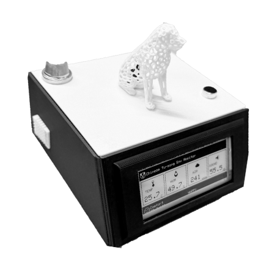 
  <em>Figure 1. The 3D-printed enclosure</em>

A biologically-informed IoT monitoring system designed for “Tu-song,” a Chow Chow living in a small student dormitory environment.  
The system monitors temperature, humidity, gases, and noise and computes a **breed-specific Comfort Index (CI)** for welfare assessment.

---

## 🐶 Why Chow Chow? Why Dorms?

Environmental monitors are typically designed for **humans**, but high-density indoor living poses unique physiological stressors for non-human inhabitants—especially double-coated, partially brachycephalic dogs such as the Chow Chow.

Chow Chows have:

- Dense double coat → high thermal sensitivity  
- Partial brachycephaly → airway restrictions under heat/humidity  
- Acute hearing → noise sensitivity in dorms  
- Sensitive skin → humidity + ammonia risk  

This project reframes environmental sensing around **species-specific comfort thresholds**, rather than generic human metrics.

---

## 🎯 Project Objectives

- Monitor key dorm environment variables  
- Map raw sensor data to a Comfort Index (CI)  
- Provide real-time feedback via LED + E-Paper  
- Detect hazard events (VOC, ammonia, noise spikes)  

---

## 🧩 System Architecture

  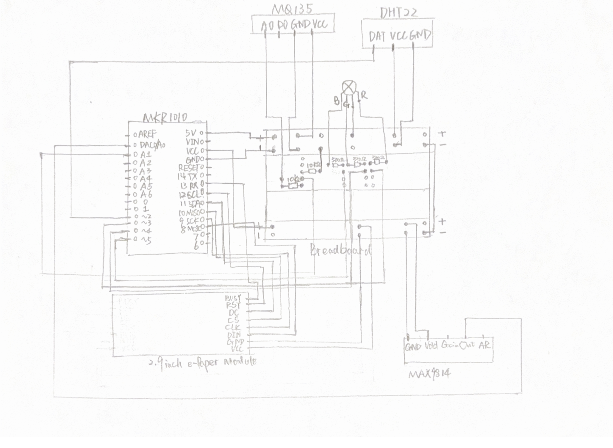 
  <em>Figure 2. The whole circuit diagram. </em>

  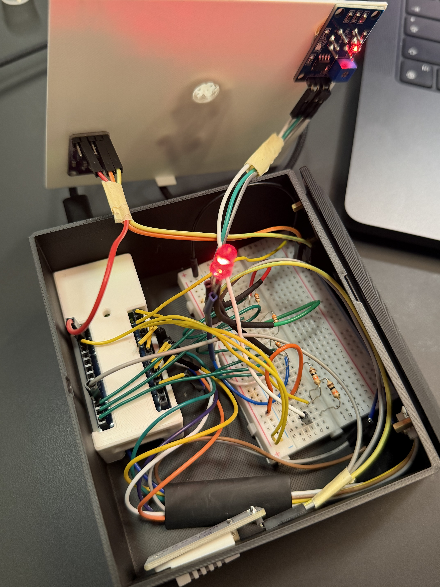 
  <em>Figure 3. The actual circuit diagram. </em>

### Sensors & Biological Rationale

| Sensor     | Parameter          | Reason (Breed-Specific)                     |
| ---------- | ------------------ | ------------------------------------------- |
| DHT22      | Temp + Humidity    | Thermal & skin sensitivity                  |
| MQ135      | VOC + Ammonia      | Pet hygiene + respiratory irritation        |
| MAX9814    | Noise level        | Stress & acoustic sensitivity               |
| E-Paper    | Visual feedback    | Zero light disturbance for the dog          |
| MKR1010    | MCU + WiFi         | Compute CI + future networking capability   |

---

## 🔌 Hardware Design

- **MCU:** Arduino MKR WiFi 1010  
- **Gas:** MQ135 (5V) + voltage divider → 3.3V logic safe  
- **Acoustic:** MAX9814 w/ Auto Gain Control (AGC)  
- **Thermal:** DHT22 ±0.5 °C  
- **Display:** 2.9" E-Paper  
- **LED Feedback:** RGB real-time indicator  
- **Resistor:** Three 330Ω Resistors and two 10kΩ Resistors

Voltage protection implemented via:

$$ float voltage = (raw / 4095.0) * 3.3 * 2.0; $$

---

## 🧠 Comfort Index (CI) Model

The originality lies in the interpretive algorithm, not the raw sensing.

$$CI = 0.3·Temp + 0.3·Humidity + 0.2·Air + 0.2·Noise$$

Each dimension uses a trapezoidal mapping, for example:

- Optimal Zone (e.g., 15–22 °C) → score = 100  
- Warning Zone → linearly decreasing score  
- Danger Zone (e.g., > 28 °C) → score = 0

  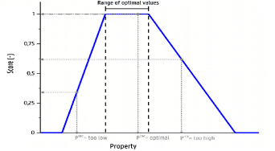 
  <em>Figure 4. The trapezoidal mapping function.</em>

  

  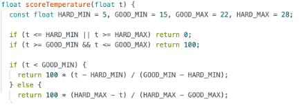 
  <em>Figure 5. The temperature score code.</em>

---

## 🚨 Safety Override

A safety override loop runs independently of the 5-minute update cycle.

It triggers immediate alerts if:

- `NH₃ > 5 ppm` (from MQ135), or  
- `Noise > 75 dB` (from MAX9814)

When triggered:

- RGB LED is forced to **Red**  
- E-Paper display is forced to refresh  
- Critical hazards are shown even in low-power mode  

---

## 🖥 Dual Feedback Layers

### **1. Real-time RGB LED**

  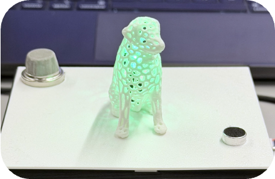 
  <em>Figure 6. The RGB LED light.</em>

Color-coded welfare state:

- 🟢 Green — Comfortable & safe environment  
- 🟡 Yellow — Mild discomfort detected  
- 🔴 Red — Poor or hazardous environmental condition  

Includes:

- Auto-sleep logic to reduce disturbance during night  
- Still respects safety override for critical alerts  

### **2. E-Paper Display**

  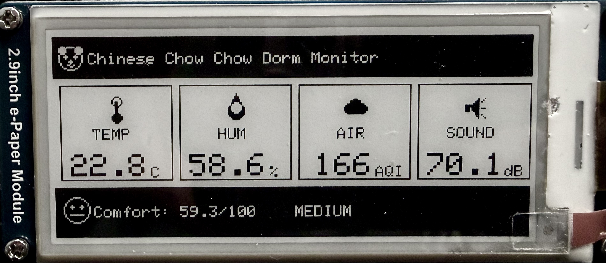 
  <em>Figure 7. The  e-paper interface.</em>

Hybrid refresh strategy:

- **Heartbeat Update:** Full refresh every 5 minutes  
- **Event-Triggered Update:** On significant changes  
  - e.g. Temp change > 0.5 °C, AQI change > 20  
- **Cooldown:** 30-second lockout to protect the screen  

This balances information freshness with power efficiency.

---

## 🏗 Physical Enclosure (Fusion 360)

  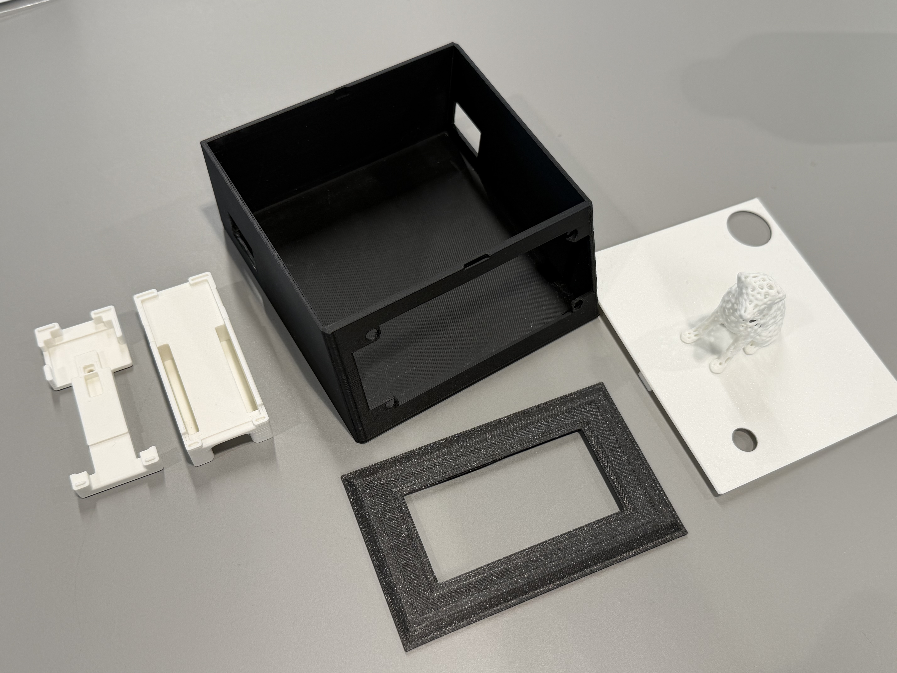 
  <em>Figure 8. All the parts of the enclosure design.</em>

The enclosure is designed with:

- Compact footprint suitable for a dorm room  
- Modular accessibility (removable top lid)  
- Dedicated cutouts for DHT22, MQ135, and MAX9814 so sensors can “see” the real environment  
- Front-facing E-Paper window for readability

  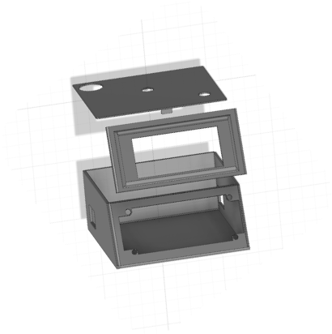 
  <em>Figure 9. The parts that I designed.</em>

### **The Voronoi Dog Diffuser**

The visual centerpiece is a 3D-printed Voronoi Dog model (based on an open-source mesh by Kijai):

- The model is hollowed to house the RGB LED  
- The Voronoi pattern diffuses light into a soft glow  
- Avoids harsh LED glare and reduces light pollution at night

  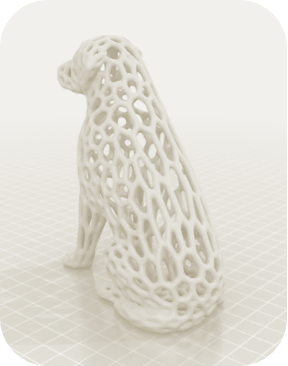 
  <em>Figure 10. The part that designed by Kijai.</em>

 

### **The MKR 1010 Case**

- Portecting the arduino mkr wi-fi 1010 in my designed box.

  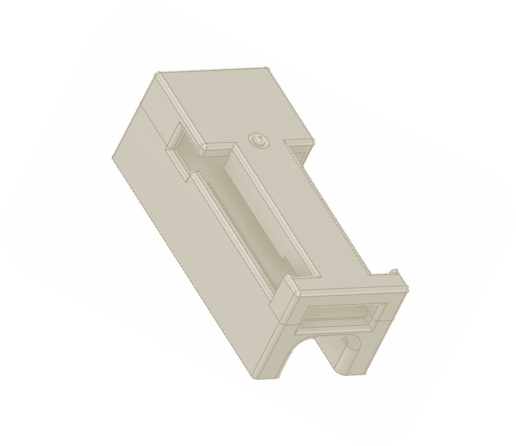 
  <em>Figure 11. The part that designed by Piotr_W.</em>

 
---

## 🧾 Evaluation

A 24-hour test in a ~20 m² student dorm showed:

- **14:00** – Direct sunlight raised temperature to ~25.5 °C → Yellow caution alert  
- **19:00** – Use of cleaning spray raised MQ135 reading to 256 ppm → Red “Dirty Air” alert  

These patterns suggest that:

- The CI mapping and thresholds respond realistically to dorm conditions  
- The system can detect and communicate real hazards relevant to a Chow Chow  

▶️ **Demo Video:** [https://youtu.be/xxxxxxx](https://youtu.be/MpVPKv-Cd-Y)

---

## ✅ Achievements & Limitations

### **Strengths**

- Breed-specific interpretation instead of generic “pet” logic  
- Trapezoidal Comfort Index algorithm implemented on MCU  
- E-Paper + Voronoi diffuser gives low-disturbance feedback  
- Custom Fusion 360 enclosure → functional + aesthetic  
- Thoughtful hardware protection (voltage divider, internal mounting)  

### **Limitations**

- MQ135 is an analog gas sensor → trend detection rather than absolute ppm accuracy  
- System is currently **monitor-only**; no active environmental control  
- MQ135 heater draws significant current → battery runtime constraints  

---

## 🚀 Future Roadmap

Planned/possible extensions:

- [ ] Add a relay-controlled fan for active ventilation  
- [ ] Integrate MQTT publishing and a remote Grafana dashboard  
- [ ] Introduce data logging for long-term comfort analysis  
- [ ] Explore CO₂ / NDIR sensors for better indoor air quality metrics  
- [ ] Power optimisation (duty-cycling, sensor sleep modes)  

---

## 🛠️ Tools & Technologies Used

### **Hardware & Prototyping**
- Arduino MKR WiFi 1010 (Cortex-M0+ MCU)
- DHT22 (Temperature & Humidity)
- MQ135 (VOC + Ammonia Gas Sensor)
- MAX9814 (AGC Microphone Module)
- 4-Pin RGB LED Indicator
- 2.9" E-Paper Display
- Breadboard + Jumper Wires + three 330Ω Resistors + two 10kΩ Resistors
- USB Power Supply

### **Software & Programming**
- Arduino IDE (Embedded C++)
- GxEPD2 (E-Paper Display Library)
- DHT Sensor Library
- Analog Signal Processing (MAX9814)
- Trapezoidal Mapping Algorithm (Custom)
- Safety Override Logic (Custom)

### **CAD & Manufacturing**
- Autodesk Fusion 360 (3D Design)
- FDM 3D Printing (Enclosure)
- PLA Filament (White & Black)
- Fusion STL Export → Slicing Pipeline

## 📚 References

- American Kennel Club (AKC) (2023) Chow Chow Dog Breed Information. Available at: https://www.akc.org/dog-breeds/chow-chow/ (Accessed: 10 January 2026).
- Analog Devices (n.d.) MAX9814: Microphone Amplifier with AGC and Low-Noise Microphone Bias. Available at: https://www.analog.com/media/en/technical- documentation/data-sheets/max9814.pdf (Accessed: 10 January 2026).
- Aosong Electronics (n.d.) Digital-output relative humidity & temperature sensor/module AM2302. Available at: https://www.mouser.com/datasheet/2/737/dht- 932870.pdf (Accessed: 5 January 2026).
- Arduino (2025) Arduino MKR Wi-Fi 1010 Documentation. Available at: https://docs.arduino.cc/hardware/mkr-wifi-1010/ (Accessed: 5 January 2026)
- Kijai (2021) Voronoi Dog. Available at: https://www.thingiverse.com/thing:4792489 (Accessed: 10 January 2026).
- Piotr_W (2021) Arduino MKR Wi-Fi 1010 case. Available at: https://www.thingiverse.com/thing:4818736 (Accessed: 10 January 2026).
- Waveshare (n.d.) 2.9inch e-Paper Datasheet. Available at: https://www.waveshare.com/wiki/File:2.9inch_e-Paper_Datasheet.pdf (Accessed: 10 January 2026).
- Winsen Sensor (2015) MQ135 Semiconductor Sensor for Hazardous Gas (Ver1.4). Available at: https://www.winsen-sensor.com/d/files/PDF/Semiconductor%20Gas%20Sensor/MQ135%20(Ver1.4)%20-%20Manual.pdf (Accessed: 10 January 2026).

## 🤖 Generative AI Use

This project used Generative AI tools (e.g. ChatGPT/Claude) in a supporting role for:

- Polishing English text (e.g. report sections, README)
- Translating mathematical ideas (trapezoidal mapping) into C++ pseudocode
- High-level debugging hints for Arduino libraries

All code and design decisions were:

- Manually validated against official datasheets
- Tested on hardware
- Owned and adapted by the author

The core concept, Comfort Index design, Fusion 360 enclosure, and full implementation were created by the author.

---
Personal Coursework for CASA0016 by Lizi
